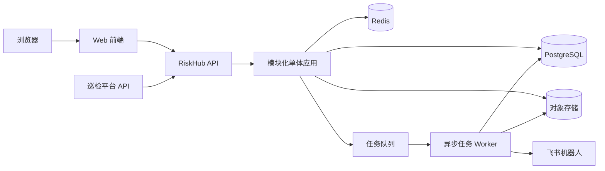
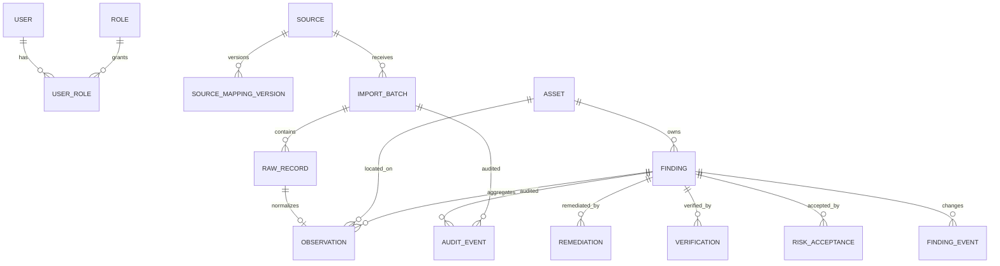
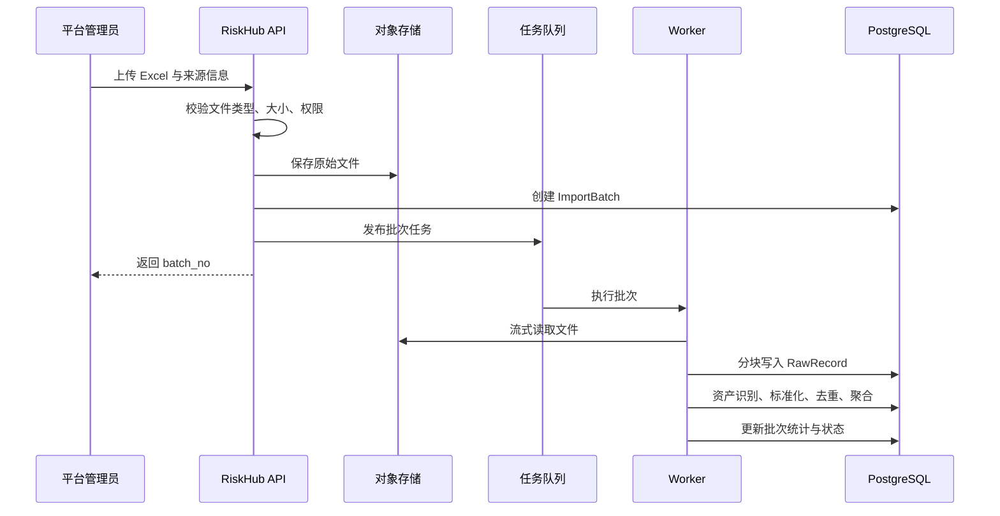

# RiskHub 轻量风险治理平台技术方案

## 1. 文档信息

| 项目 | 内容 |
| --- | --- |
| 文档版本 | v0.1 |
| 方案阶段 | MVP 技术设计 |
| 产品基线 | `docs/PRD.md` |
| 交互基线 | `designs/risk-governance-demo/` |
| 架构形态 | 前后端分离、模块化单体、异步任务 |

## 2. 方案目标

本方案用于指导 RiskHub MVP 的工程实现，确保最终产品与现有 Demo 的信息架构和操作流程一致，并满足以下目标：

- 支持 Excel 与 API 风险接入，单批次最多处理 10,000 条记录。
- 原始发现、统一风险、资产和整改流程之间具有清晰的数据边界。
- 支持确定性去重、风险分级、分派、SLA、整改、验证和风险接受。
- 关键操作可审计，统计指标可追溯。
- 三类用户角色权限在服务端强制执行。
- 支持浅色与深色主题，并保持现有 Demo 的高信息密度桌面布局。
- MVP 保持部署简单，同时为后续新增适配器、通知渠道和任务规模扩展预留接口。

## 3. 设计原则

### 3.1 模块化单体优先

MVP 不采用微服务。用户、资产、接入、风险、工作流、通知、报表等模块在同一后端应用中部署，但在代码和数据库访问层面保持模块边界。

这样可以减少服务治理、链路追踪、分布式事务和部署维护成本。只有当单个模块出现独立扩缩容或团队边界需求时，再拆分服务。

### 3.2 原始事实与治理状态分离

- `Observation` 保存某个来源、某个批次看到的事实。
- `Finding` 保存平台聚合后的统一风险和治理状态。
- 来源重新导入时不得覆盖人工产生的整改、验证、分派和审批信息。

### 3.3 同步请求轻量化

列表查询、详情查看和治理操作同步完成；文件解析、批量标准化、去重、通知、报表快照等耗时操作进入异步队列。

### 3.4 可解释、可回放

所有自动判断均需保存规则版本和命中信息。导入批次可根据原始文件、字段映射版本和规则版本重新处理，但重放前必须进行影响预览。

### 3.5 服务端作为规则权威

前端只控制显示和交互提示。状态转换、角色权限、职责分离、SLA 和关闭条件必须由后端再次校验，不能依赖按钮是否可见。

## 4. 总体架构



### 4.1 组件职责

| 组件 | 职责 |
| --- | --- |
| Web 前端 | 实现 Demo 中的工作台、台账、详情、接入、资产、报表、配置和审计页面 |
| RiskHub API | 鉴权、权限校验、参数校验、事务编排、查询和命令接口 |
| Worker | 文件解析、标准化、去重、批量统计、通知、SLA 扫描和报表快照 |
| PostgreSQL | 保存业务主数据、状态事件、规则版本和审计记录 |
| Redis | 任务队列、短期缓存、接口限流和分布式任务锁 |
| 对象存储 | 保存导入文件、整改证据、导出文件和错误明细 |
| 飞书机器人 | 发送分派、临期、逾期、驳回和风险接受到期通知 |

## 5. 推荐技术栈

| 层次 | 推荐方案 | 选择理由 |
| --- | --- | --- |
| 前端 | React + TypeScript + Vite | 适合中后台复杂交互，类型约束清晰，构建简单 |
| UI | Ant Design 作为基础组件，业务视觉使用主题 Token 覆盖 | 表格、表单、弹窗、筛选等中后台组件完善，可还原 Demo |
| 状态管理 | 服务端状态使用 TanStack Query；少量全局 UI 状态使用 Zustand | 区分接口缓存和本地交互状态，避免单一大 Store |
| 路由 | React Router | 支持列表筛选条件、详情页和浏览器历史 |
| 后端 | Python + FastAPI | 数据解析生态成熟，适合快速实现接入适配器和 API |
| ORM 与迁移 | SQLAlchemy + Alembic | 明确模型与数据库迁移，避免手工修改表结构 |
| 异步任务 | Celery + Redis | 适合批次处理、重试、定时扫描和通知任务 |
| 数据库 | PostgreSQL | 支持事务、JSONB、部分索引、全文检索及复杂报表查询 |
| 文件解析 | openpyxl | 支持 Excel 流式读取和模板校验 |
| 对象存储 | S3 兼容存储；本地开发使用 MinIO | 与云厂商解耦，便于保存文件和证据 |
| 鉴权 | JWT 短期访问令牌 + 安全刷新机制 | 满足前后端分离与 API 接入需求 |
| 测试 | Pytest、Vitest、React Testing Library、Playwright | 覆盖后端、前端组件和端到端流程 |
| 部署 | Docker Compose 起步 | 单机即可部署，组件边界明确，后续可迁移 Kubernetes |

具体依赖版本在工程初始化时统一锁定，不在方案阶段写死。生产环境不得直接使用 Demo 中的原生 JavaScript 文件作为业务实现。

## 6. 后端模块划分

```text
app/
├── identity/       用户、角色、登录与权限
├── assets/         资产及责任映射
├── sources/        来源、字段映射、适配器配置
├── ingestion/      文件/API 接入、批次和原始记录
├── findings/       Observation、Finding、去重和分级
├── workflow/       分派、状态机、整改、验证、风险接受
├── sla/            SLA 策略、截止时间、临期和逾期
├── notifications/  平台内通知与飞书通知
├── reporting/      工作台指标、报表查询和历史快照
├── audit/          不可变审计事件
└── shared/         数据库、任务、对象存储、错误码等基础能力
```

模块间通过应用服务和显式接口调用，不允许跨模块直接修改对方的数据表。MVP 可以共用数据库和事务，但领域规则必须集中在所属模块中。

## 7. 核心数据模型

### 7.1 关系概览



### 7.2 公共字段约定

核心业务表统一包含：

- `id`：UUID 主键。
- `created_at`、`updated_at`：UTC 时间，接口按用户时区展示。
- `created_by`、`updated_by`：操作用户；系统任务使用固定系统主体。
- `version`：乐观锁版本号，防止多人操作覆盖。
- `deleted_at`：仅允许在明确支持逻辑删除的配置类数据上使用。

Finding、Observation、状态事件和审计事件默认不可物理删除。

### 7.3 核心表

#### `users`、`roles`、`user_roles`

角色固定为：

- `platform_admin`：平台管理员。
- `remediator`：整改人员。
- `verifier`：验证人员。

同一用户可以同时具有整改和验证角色，但同一 Finding 的 `assignee_id` 与 `verifier_id` 默认不能相同。

#### `assets`

核心字段：`asset_code`、`name`、`type`、`external_id`、`business_system`、`team`、`owner_id`、`importance`、`exposure`、`environment`、`status`。

约束与索引：

- `asset_code` 全局唯一。
- `source_id + external_id` 通过资产映射表保持唯一。
- 为 `team`、`owner_id`、`importance`、`status` 建立查询索引。

#### `sources`

核心字段：`source_code`、`name`、`ingestion_type`、`enabled`、`adapter_type`、`credential_ref`、`owner_id`。

敏感凭据不得直接存储在表内，`credential_ref` 指向密钥管理系统或加密配置。

#### `source_mapping_versions`

保存字段映射、等级映射、时间格式、资产识别规则、去重配置和版本状态。已被批次引用的版本不可修改，只能创建新版本。

#### `import_batches`

核心字段：`batch_no`、`source_id`、`mapping_version_id`、`idempotency_key`、`file_object_key`、`file_sha256`、`status`、`total_count`、`success_count`、`failed_count`、`skipped_count`、`started_at`、`finished_at`、`error_summary`。

约束：`source_id + idempotency_key` 唯一；文件导入可使用 `source_id + file_sha256` 检测重复并要求用户确认。

#### `raw_records`

核心字段：`batch_id`、`row_no`、`raw_payload`、`payload_hash`、`process_status`、`error_code`、`error_message`。

`raw_payload` 使用 JSONB 保存结构化原始记录。超大证据不写入 JSONB，而存储对象引用。

#### `observations`

核心字段：

- 来源：`source_id`、`batch_id`、`raw_record_id`、`source_finding_id`、`source_rule_id`。
- 标准化：`title`、`description`、`recommendation`、`source_severity`、`normalized_location`、`observed_at`。
- 资产：`asset_id`。
- 去重：`dedup_key`、`dedup_rule_version`、`match_method`、`finding_id`。

幂等约束优先使用 `source_id + asset_id + source_finding_id + observed_at`；来源无法提供稳定 ID 时使用 `batch_id + row_no` 保证同一批次不重复。

#### `findings`

核心字段：

- 标识：`finding_no`、`asset_id`、`title`、`category`。
- 风险：`severity`、`risk_score`、`priority`、`risk_rule_version`、`severity_overridden`。
- 治理：`status`、`owner_id`、`assignee_id`、`verifier_id`、`due_at`。
- 时间：`first_seen_at`、`last_seen_at`、`resolved_at`、`verified_at`、`closed_at`。
- 聚合：`observation_count`、`source_count`、`reopen_count`。

`observation_count` 和 `source_count` 是可重建的冗余字段，用于列表性能。更新 Finding 与关联 Observation 必须在同一数据库事务中完成。

#### `finding_events`

保存状态变化和关键业务事件，是时间线与趋势报表的数据来源。核心字段：`finding_id`、`event_type`、`from_status`、`to_status`、`actor_id`、`occurred_at`、`payload`、`request_id`。

#### `remediations` 与 `verifications`

- `remediations`：整改说明、提交人、提交时间、证据对象列表和版本。
- `verifications`：验证方式、验证人、结果、意见、验证时间和关联整改版本。

每次验证必须明确对应哪个整改版本，避免整改再次提交后旧验证被错误复用。

#### `risk_acceptances`（RiskAcceptance）

核心字段：`finding_id`、`status`、`reason`、`compensating_control`、`requested_by`、`approved_by`、`starts_at`、`expires_at`、`decision_comment`。

数据库约束保证 `expires_at > starts_at`。应用层保证申请人与审批人不同。

#### `audit_events`（AuditEvent）

核心字段：`actor_id`、`action`、`object_type`、`object_id`、`before_data`、`after_data`、`request_id`、`client_ip`、`occurred_at`。

审计表只允许追加，不提供更新和普通删除接口。敏感字段进入审计记录前需要脱敏。

## 8. 风险接入处理链路

### 8.1 文件导入



### 8.2 API 接入

- 调用方使用独立 API 凭据，并绑定允许写入的 Source。
- 请求头必须提供 `Idempotency-Key`，服务端在单一事务中创建批次。
- 请求同步完成 schema 校验并返回批次号，业务处理异步执行。
- 单次请求条数设置上限；超出时要求调用方分批提交。
- API 返回批次级状态，逐条错误通过批次详情查询。

### 8.3 批次状态机

```text
PENDING → VALIDATING → PROCESSING → SUCCESS
                              ├──→ PARTIAL_SUCCESS
                              └──→ FAILED
```

批次处理使用数据库状态和任务锁保证同一批次同一时刻只能有一个 Worker 执行。任务重试时从已完成的处理阶段和记录游标继续，不重复创建 Observation。

### 8.4 分块与事务

- Excel 使用只读流式模式，不一次性载入整个工作簿。
- 每 200～500 条记录作为一个处理分块，具体值通过压测确定。
- 单条错误写入 `raw_records`，不回滚整个批次。
- 一个分块失败时回滚当前分块并重试，不影响已经提交的分块。
- 批次完成后通过数据库聚合得到最终统计，避免仅依赖 Worker 内存计数。

## 9. 标准化、资产识别与去重

### 9.1 适配器接口

每个来源适配器实现统一接口：

```text
validate(raw_record) -> ValidationResult
normalize(raw_record, mapping_version) -> NormalizedObservation
resolve_asset(normalized_observation) -> AssetResolution
build_dedup_key(normalized_observation, rule_version) -> DedupResult
```

适配器只负责来源差异，不直接修改 Finding 状态。

### 9.2 资产识别顺序

1. 使用来源资产外部 ID 查询显式映射。
2. 使用标准化后的资产唯一键匹配，例如域名、仓库地址、云资源 ID。
3. 没有匹配时进入待确认队列。
4. MVP 不自动把模糊匹配结果写成正式资产。

### 9.3 去重优先级

```text
优先级 1：source + asset + source_finding_id
优先级 2：source + asset + source_rule_id + normalized_location
优先级 3：source + asset + configured_hash_fields
```

`dedup_key` 使用规范化字段拼接后计算 SHA-256。参与字段、标准化值、规则版本和匹配结果均保存，便于解释和排错。

### 9.4 去重事务

1. 根据作用域和 `dedup_key` 查询有效 Finding。
2. 命中则创建 Observation 关联并更新 Finding 聚合字段。
3. 未命中则创建新的 Finding，再关联 Observation。
4. 使用数据库唯一索引或事务级锁防止并发创建两个主 Finding。
5. 已关闭 Finding 再次命中时创建 `REOPENED_BY_OBSERVATION` 事件并转为待确认。

### 9.5 人工合并与拆分

- 合并采用一个主 Finding，迁移从 Finding 的 Observation，并保留来源 Finding 的重定向记录。
- 拆分时选择要移出的 Observation，重新匹配或创建 Finding。
- 两种操作都在单一事务中执行，必须填写原因，并生成业务事件与审计事件。
- 已产生整改或验证记录的 Finding 不自动删除。

## 10. 风险分级与 SLA

### 10.1 风险计算

MVP 使用可配置矩阵，不使用不可解释的模型：

```text
priority_score = severity_weight × asset_importance_weight × exposure_weight
```

映射结果输出 `severity`、`risk_score` 和 `priority`。规则以版本化 JSON 配置保存，Finding 记录计算版本和因子快照。

人工调整统一等级时必须填写原因并设置 `severity_overridden = true`。后续批次不得自动覆盖人工等级；管理员可以显式取消覆盖并重新计算。

### 10.2 SLA 计算

- SLA 从 Finding 首次进入待整改状态开始。
- `due_at = sla_started_at + policy_days`，按自然日计算；工作日能力后续扩展。
- 重新导入不会重置 SLA。
- 风险再次打开默认沿用原 SLA，并继续累计逾期。
- 风险接受生效期间保留原 SLA 数据，但从普通逾期统计中单独标识。
- 管理员重置 SLA 必须填写原因并写入审计事件。

定时任务每小时扫描未来提醒窗口和已逾期 Finding。通知采用幂等键 `finding_id + notice_type + notice_date` 防止重复发送。

## 11. Finding 状态机

### 11.1 状态定义

后端使用固定枚举：

```text
PENDING_CONFIRMATION  待确认
PENDING_REMEDIATION   待整改
IN_REMEDIATION        整改中
PENDING_VERIFICATION  待验证
CLOSED                已关闭
FALSE_POSITIVE        误报
ACCEPTANCE_REQUESTED  风险接受申请
RISK_ACCEPTED         风险已接受
```

### 11.2 关键转换规则

| 操作 | 原状态 | 目标状态 | 角色 | 前置条件 |
| --- | --- | --- | --- | --- |
| 确认风险 | 待确认 | 待整改 | 平台管理员 | 已设置资产、Owner、整改人、验证人和 SLA |
| 标记误报 | 待确认 | 误报 | 平台管理员 | 必须填写原因 |
| 开始整改 | 待整改 | 整改中 | 整改人员 | 当前用户是整改人 |
| 提交整改 | 整改中 | 待验证 | 整改人员 | 有整改说明和至少一项证据 |
| 验证通过 | 待验证 | 已关闭 | 验证人员 | 当前用户是验证人，且与整改人不同 |
| 验证驳回 | 待验证 | 整改中 | 验证人员 | 必须填写原因 |
| 申请接受 | 待整改/整改中 | 风险接受申请 | 整改人员 | 有理由、补偿措施和到期时间 |
| 批准接受 | 风险接受申请 | 风险已接受 | 平台管理员 | 审批人与申请人不同 |
| 拒绝接受 | 风险接受申请 | 待整改 | 平台管理员 | 必须填写意见 |
| 接受到期 | 风险已接受 | 待整改 | 系统 | 到达过期时间 |
| 再次发现 | 已关闭/误报 | 待确认 | 系统 | 新 Observation 有效命中 |

状态转换通过统一的 `FindingWorkflowService` 执行。任何控制器、任务或脚本都不能直接更新 `findings.status`。

## 12. 权限设计

### 12.1 权限矩阵

| 能力 | 平台管理员 | 整改人员 | 验证人员 |
| --- | --- | --- | --- |
| 查看工作台和授权风险 | 全部 | 分配给自己或授权范围 | 分配给自己或授权范围 |
| 管理来源与导入 | 是 | 否 | 否 |
| 管理资产与规则 | 是 | 否 | 否 |
| 调整等级、分派和 SLA | 是 | 否 | 否 |
| 开始整改、提交证据 | 可代操作并审计 | 仅本人任务 | 否 |
| 验证通过或驳回 | 可代操作并审计 | 否 | 仅本人任务 |
| 申请风险接受 | 是 | 仅本人任务 | 否 |
| 审批风险接受 | 是 | 否 | 否 |
| 查看审计日志 | 是 | 仅自身相关时间线 | 仅自身相关时间线 |
| 查看报表 | 全部 | 个人范围 | 个人范围 |

### 12.2 实现方式

- 路由级检查用户是否具备基础角色。
- 应用服务级检查资源范围、当前分派和状态前置条件。
- 查询层自动附加数据范围条件，不能仅在返回结果后过滤。
- 管理员代整改或代验证时必须填写代操作原因。
- 接口返回 `allowed_actions`，前端据此展示按钮，但服务端仍独立校验。

## 13. API 设计

### 13.1 约定

- API 前缀：`/api/v1`。
- 统一返回请求 ID，错误响应包含稳定错误码和可读提示。
- 列表使用游标或页码分页；MVP 管理台默认页码分页。
- 查询筛选通过 URL 参数表达，便于复制链接和浏览器回退。
- 修改请求携带 `version` 或 `If-Match`，检测并发更新。
- 批量写入和状态转换要求幂等键。

### 13.2 核心接口

#### 身份与用户

```text
POST   /api/v1/auth/login
POST   /api/v1/auth/refresh
GET    /api/v1/me
GET    /api/v1/users
```

#### 风险与流程

```text
GET    /api/v1/findings
GET    /api/v1/findings/{id}
GET    /api/v1/findings/{id}/observations
GET    /api/v1/findings/{id}/events
PATCH  /api/v1/findings/{id}/assignment
PATCH  /api/v1/findings/{id}/severity
POST   /api/v1/findings/{id}/transitions
POST   /api/v1/findings/{id}/remediations
POST   /api/v1/findings/{id}/verifications
POST   /api/v1/findings/{id}/risk-acceptances
POST   /api/v1/findings/{id}/merge
POST   /api/v1/findings/{id}/split
```

状态转换使用动作而不是直接 PATCH 状态：

```json
{
  "action": "START_REMEDIATION",
  "reason": "开始实施修复",
  "version": 4
}
```

#### 接入与资产

```text
GET    /api/v1/sources
POST   /api/v1/sources
GET    /api/v1/import-batches
POST   /api/v1/import-batches/files
POST   /api/v1/import-batches/api
GET    /api/v1/import-batches/{id}
GET    /api/v1/import-batches/{id}/errors
GET    /api/v1/assets
GET    /api/v1/assets/{id}
```

#### 工作台、报表与审计

```text
GET    /api/v1/dashboard/summary
GET    /api/v1/dashboard/priorities
GET    /api/v1/reports/risk-trend
GET    /api/v1/reports/sla
GET    /api/v1/reports/efficiency
GET    /api/v1/reports/data-quality
GET    /api/v1/audit-events
```

## 14. 前端实现方案

### 14.1 页面路由

| Demo 页面 | 建议路由 | 主要接口 |
| --- | --- | --- |
| 工作台 | `/dashboard` | `/dashboard/summary`、`/dashboard/priorities` |
| 我的待办 | `/my-work` | `/findings?scope=my_work` |
| 风险台账 | `/findings` | `/findings` |
| 风险详情 | `/findings/:id` | Finding、Observation、Event 和 allowed_actions |
| 资产中心 | `/assets` | `/assets` |
| 接入中心 | `/sources` | `/sources` |
| 导入批次 | `/import-batches` | `/import-batches` |
| 报表中心 | `/reports` | `/reports/*` |
| 治理配置 | `/settings/governance` | 等级、去重、SLA、分派和通知配置接口 |
| 审计日志 | `/audit-events` | `/audit-events` |

### 14.2 前端模块

```text
src/
├── app/             路由、权限守卫、主题和全局错误处理
├── features/
│   ├── dashboard/
│   ├── findings/
│   ├── ingestion/
│   ├── assets/
│   ├── reports/
│   ├── governance/
│   └── audit/
├── components/      表格、筛选器、等级标签、状态步骤、时间线等
├── api/             API Client、类型和错误处理
├── theme/           浅色/深色 Token
└── test/            测试工具与 Mock Server
```

### 14.3 状态与 URL

- 风险列表的关键词、等级、状态、Owner、时间和页码写入 URL 查询参数。
- 服务端数据通过 Query Key 缓存；执行状态转换后精确刷新详情、列表和工作台指标。
- 弹窗表单使用局部状态，不写入全局 Store。
- 防止重复提交：操作按钮提交后进入 loading，后端同时使用幂等键兜底。

### 14.4 主题系统

- 浅色和深色均使用语义 Token：背景、面板、边框、正文、弱文本、主色和风险色。
- 用户选择保存在浏览器本地；登录用户同时可保存到个人偏好设置。
- 页面初始化时在渲染前设置主题属性，避免闪烁。
- 风险等级不能只依赖颜色表达，必须同时展示文字标签。
- 图表、表格悬停、弹窗遮罩、焦点环和禁用状态均需分别验证两种主题。

### 14.5 Demo 迁移策略

现有 Demo 作为交互验收基线，不直接演进为生产代码：

1. 提取 Demo 的颜色、间距、边框、字号和主题为设计 Token。
2. 将导航壳、指标卡、风险表格、状态步骤、详情区和操作弹窗拆成组件。
3. 先使用 Mock Service Worker 对接与后端一致的 API 契约。
4. 完成页面视觉回归后再切换真实 API。
5. 每完成一个页面，按 Demo 的浅色和深色截图进行对比验收。

## 15. 报表与统计

### 15.1 数据来源

- 当前存量来自 `findings` 当前状态。
- 新增、关闭、重新打开趋势来自 `finding_events`。
- 导入质量来自 `import_batches` 与 `raw_records`。
- SLA 达标率基于 `sla_started_at`、`due_at` 和 `verified_at`。

### 15.2 实现阶段

MVP 初期使用 PostgreSQL 聚合查询，并对常用过滤字段建立组合索引。每日生成 `report_daily_snapshots`，用于风险年龄和历史存量报表。

当数据量或报表查询影响在线事务后，再引入只读副本、物化视图或独立分析数据库，不在 MVP 提前建设数仓。

### 15.3 缓存策略

- 工作台摘要缓存 1～5 分钟。
- 报表查询按角色范围、筛选条件和统计日期组合缓存。
- Finding 状态变更后主动失效相关工作台缓存。
- 风险详情和审计记录默认不做跨用户长时间缓存。

## 16. 通知设计

通知采用 Outbox 模式：业务事务在数据库中同时写入状态变化和待发送事件，Worker 再异步投递，避免状态已变更但通知事件丢失。

```text
业务事务 → notification_outbox → Worker → 平台内通知 / 飞书
                                  ↓
                              结果与重试记录
```

- 每条消息具有业务幂等键。
- 失败采用有限次数指数退避，超过阈值进入死信状态并告警。
- 同一用户、同一通知类型在短窗口内可以汇总。
- 消息内容只包含必要信息；敏感证据通过受控链接访问。

## 17. 安全设计

### 17.1 身份与会话

- 密码使用强哈希算法保存，不记录明文和可逆密文。
- 访问令牌短期有效，刷新令牌支持撤销和轮换。
- API 来源凭据与用户会话凭据分离。
- 登录失败限流，并记录安全审计事件。

### 17.2 输入与文件

- 所有输入使用明确 Schema 校验，拒绝未知危险字段。
- Excel 限制扩展名、MIME、文件大小、工作表和行数。
- 文件名由服务端重新生成，禁止路径穿越。
- 文件进入对象存储前执行恶意内容检查；未完成检查前不得下载。
- HTML 风险描述默认以纯文本呈现；如需富文本，必须进行严格白名单清洗。

### 17.3 数据访问

- 数据权限在查询条件和命令处理器中执行。
- 下载证据使用短期签名 URL，并校验用户权限。
- 数据库账户遵循最小权限；Worker 与 API 可使用不同账户。
- 审计数据、备份和对象存储分别设置保留与访问策略。

### 17.4 接口防护

- API 限流按用户、来源凭据和接口维度配置。
- 修改接口防止 CSRF；Cookie 方案使用 SameSite 与 CSRF Token。
- 设置安全响应头、合理 CORS 白名单和上传下载 Content-Disposition。
- 日志过滤 Authorization、Cookie、密码、令牌和完整证据内容。

## 18. 可观测性与运维

### 18.1 日志

使用结构化日志，统一字段包括：`timestamp`、`level`、`service`、`request_id`、`user_id`、`batch_id`、`finding_id`、`duration_ms` 和 `error_code`。

### 18.2 指标

至少监控：

- API 请求量、延迟、错误率和慢查询。
- 队列长度、任务耗时、重试数和死信数。
- 导入成功率、每分钟处理记录数和资产未识别数。
- 去重命中率、并发冲突数和人工拆分率。
- 通知成功率和发送延迟。
- 数据库连接、CPU、内存、磁盘和备份状态。

### 18.3 告警

- 连续导入失败或失败率超过阈值。
- 队列积压超过容量或最长任务等待时间。
- API 错误率和 P95 延迟异常。
- 通知持续失败。
- 数据库剩余空间、备份或恢复验证失败。

## 19. 部署方案

### 19.1 MVP 拓扑

```text
Reverse Proxy
    ├─ Web 静态资源
    └─ API × 1～2
         ├─ PostgreSQL
         ├─ Redis
         ├─ Worker × 1～N
         └─ S3 / MinIO
```

开发和测试环境使用 Docker Compose。生产环境可以先部署在单台或少量虚拟机上，PostgreSQL 和对象存储优先使用具备备份能力的托管服务。

### 19.2 配置与密钥

- 环境配置通过环境变量或配置文件注入，代码仓库不保存密钥。
- 数据库、Redis、对象存储和飞书凭据由密钥管理系统托管。
- 开发、测试和生产使用独立账户、数据库和存储桶。

### 19.3 发布与迁移

- 数据库迁移作为发布步骤执行，并支持向前兼容的滚动升级。
- 先增加字段和双写，再切换读取，最后在后续版本删除旧结构。
- Worker 与 API 版本必须兼容同一任务消息结构。
- 发布失败以应用版本回滚为主；已执行的不可逆数据迁移需单独预案。

## 20. 性能与容量设计

### 20.1 初始容量假设

| 指标 | MVP 设计值 |
| --- | --- |
| 用户 | 500 以内 |
| 统一风险 | 100,000 条 |
| Observation | 1,000,000 条 |
| 单批导入 | 10,000 条 |
| 日导入批次 | 500 以内 |
| 并发在线用户 | 100 以内 |

真实上线前需根据首批来源样例修正容量假设。

### 20.2 关键优化

- Finding 列表只查询必要字段，详情数据按 Tab 延迟加载。
- 对状态、等级、资产、Owner、整改人、截止时间和最近发现时间建立合适索引。
- Observation 历史列表按 Finding 和时间分页。
- 计数和来源数采用事务内增量更新，并通过定期校验任务修复偏差。
- 导出使用异步任务生成文件，不在 HTTP 请求内加载全部数据。
- 慢报表使用快照或物化视图，不占用在线事务连接池。

## 21. 测试方案

### 21.1 测试分层

| 层级 | 重点 |
| --- | --- |
| 单元测试 | 标准化、指纹、风险矩阵、SLA、权限和状态机 |
| 数据库集成测试 | 唯一约束、事务、并发去重、迁移与查询范围 |
| API 契约测试 | 参数、错误码、分页、幂等、乐观锁和角色权限 |
| Worker 测试 | 文件分块、断点重试、失败隔离和通知重试 |
| 前端组件测试 | 筛选、表单、状态按钮、主题和错误状态 |
| 端到端测试 | 导入到关闭的主流程及三类角色切换 |
| 性能测试 | 10,000 条导入、100,000 条台账查询和报表聚合 |
| 安全测试 | 越权、上传、注入、XSS、令牌与敏感日志 |

### 21.2 必测主流程

1. 管理员导入混合有效、错误和重复记录的 Excel。
2. 系统正确识别资产，生成 Observation 并聚合 Finding。
3. 同一批次重试不重复创建数据。
4. 管理员确认风险、调整分派并生成 SLA。
5. 整改人员开始整改并提交证据。
6. 验证人员驳回一次，整改人员重新提交。
7. 验证人员验证通过并关闭风险。
8. 新批次再次命中已关闭风险，风险重新进入待确认。
9. 整改人员申请风险接受，管理员审批，到期后系统恢复待整改。
10. 浅色和深色主题下完成台账、详情、弹窗和图表视觉回归。

### 21.3 质量门禁

- 所有单元、集成和端到端测试通过后才能合并。
- 数据库迁移必须通过全新安装和从上一版本升级两类测试。
- 新增状态转换必须同时增加成功、越权和前置条件失败测试。
- 新增适配器必须提供真实脱敏样例及失败样例。
- 前端关键页面必须通过浅色、深色和 1440px 桌面宽度检查。

## 22. 实施计划

### 阶段 1：工程骨架与基础能力

- 建立前后端工程、数据库迁移、任务队列和本地开发环境。
- 实现登录、三角色权限、资产、来源和审计基础能力。
- 根据 Demo 建立主题 Token、应用壳和通用组件。

### 阶段 2：接入与风险台账

- 实现 Excel/API 接入、批次追踪、错误下载和原始记录。
- 实现资产识别、Observation、Finding 和确定性去重。
- 实现风险台账、详情、筛选、分页和发现记录 Tab。

### 阶段 3：治理闭环

- 实现分级、Owner、SLA、状态机、整改证据和验证。
- 实现风险接受、重新打开、通知和完整时间线。
- 完成三角色端到端闭环测试。

### 阶段 4：报表与上线准备

- 实现工作台、风险趋势、SLA、整改效率和数据质量报表。
- 完成性能、安全、备份恢复和监控告警验证。
- 导入首批脱敏历史数据并进行业务验收。

## 23. 工程目录建议

```text
riskhub/
├── apps/
│   ├── web/                 React 前端
│   ├── api/                 FastAPI 应用
│   └── worker/              Celery Worker 启动入口
├── packages/
│   ├── api-contract/        OpenAPI 生成的前端类型
│   └── design-tokens/       与 Demo 对齐的主题 Token
├── deploy/
│   ├── compose/
│   └── reverse-proxy/
├── docs/
├── tests/
│   ├── e2e/
│   ├── performance/
│   └── fixtures/
├── pyproject.toml
└── package.json
```

如果团队更倾向前后端独立仓库，可以在工程启动前拆分；MVP 推荐 Monorepo，以便接口契约、测试环境和设计 Token 同步演进。

## 24. 架构决策记录

| 决策 | 结论 | 原因 |
| --- | --- | --- |
| 服务形态 | 模块化单体 | 降低 MVP 运维和分布式复杂度 |
| 数据库 | PostgreSQL | 满足事务、JSONB、索引和报表需求 |
| 耗时处理 | 异步 Worker | 避免导入、通知和导出阻塞接口 |
| 原始与治理模型 | Observation 与 Finding 分离 | 保留来源事实并稳定承载整改历史 |
| 状态更新 | 动作式状态机接口 | 防止非法跳转和绕过前置条件 |
| 通知可靠性 | Outbox | 保证业务状态与待发送事件一致 |
| 报表 | 事务库聚合 + 每日快照 | MVP 简单可控，后续按规模演进 |
| 前端主题 | 语义 Token 双主题 | 复用 Demo 视觉并保证可维护性 |

## 25. 上线前待确认

1. 生产部署环境、域名、证书和网络访问范围。
2. 是否已有 PostgreSQL、Redis、对象存储和密钥管理服务。
3. 首批巡检平台的脱敏样例、稳定 ID 和资产标识质量。
4. 资产主数据来源及临时资产处理规则。
5. 正式的风险矩阵、SLA 天数和风险接受最长期限。
6. 整改人与验证人职责分离是否允许管理员例外。
7. 飞书机器人接入范围及消息模板审批要求。
8. 原始文件、证据、审计和备份数据的保留期限。
9. 企业统一登录是否需要在 MVP 上线前完成。
10. 容量假设是否符合历史数据和未来一年增量。

## 26. 交付判定

满足以下条件后，可认为 MVP 技术实现达到交付标准：

- Demo 中全部一级页面已连接真实接口，交互和双主题表现一致。
- Excel/API 接入、去重、状态流转、整改验证和风险接受端到端通过。
- 三类角色不存在已知越权路径，服务端拒绝非法状态转换。
- 单批 10,000 条记录和 100,000 条风险台账达到 PRD 性能目标。
- 审计、通知、报表、备份恢复和监控告警通过验收。
- 数据库迁移、自动化测试、安全检查和发布回滚演练全部通过。
